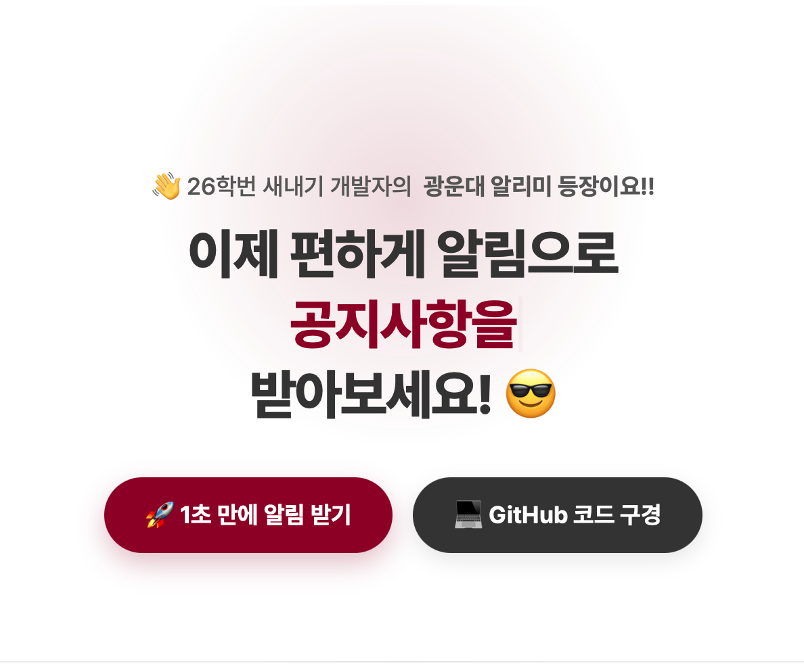

# 📢 광운대 알리미 (KW Alert)

> **"아직도 학교 홈페이지 매일 들어가니? 이제 텔레그램으로 편하게 받아보세요!"** > 26학번 새내기 개발자가 만든, 가장 쉽고 빠른 광운대 공지 알림 서비스입니다.

---

## 🙋‍♂️ 소개 (Introduction)

**광운대 알리미**는 학교 생활에 꼭 필요한 정보(공지사항, 학사일정, 학식 등)를 텔레그램으로 실시간 전송해주는 봇 서비스입니다.  
복잡한 앱 설치 없이, **[채널 구독]** 버튼 하나면 끝! 매일 아침 브리핑과 스마트한 공지 알림을 받아보세요.

이 저장소(Repository)는 **서비스 소개 및 랜딩 페이지**의 소스코드를 담고 있습니다.  
(실제 알림 봇의 파이썬 소스코드는 [여기(web-monitor)](https://github.com/viban0/web-monitor)에서 확인하실 수 있습니다.)

## ✨ 주요 기능 (Key Features)

### 1. 🔔 **놓치면 손해인 공지 알림**
- 장학금, 공모전, 꿀알바 등 중요한 공지를 실시간으로 크롤링하여 보냅니다.
- '교수지원팀' 공지처럼 학생과 무관한 내용은 **알아서 필터링**합니다.

### 2. 📅 **매일 아침 모닝 브리핑**
- "아 맞다 수강신청!" 하는 일 없도록, 매일 아침 **오늘의 일정**과 **주요 D-Day**를 브리핑해 드립니다.

### 3. 🍱 **오늘의 학식 (함지마루)**
- 메뉴 고민할 시간에 확인하세요! 매일 아침 함지마루 식단을 배달해 드립니다.

### 4. 🤖 **스마트 분류 & 이모지**
- 파이썬 봇이 공지 내용을 분석하여 `💰 장학`, `📅 학사` 등 적절한 이모지를 자동으로 붙여줍니다.

---

## 🛠️ 기술 스택 (Tech Stack)

이 프로젝트는 **Serverless** 환경에서 효율적으로 동작하도록 설계되었습니다.

- **Frontend (Landing Page):** HTML5, CSS3 (Pretendard Font), JavaScript (Swiper.js)
- **Bot Core:** Python (Scraping & Diff Logic)
- **Infra & DevOps:** GitHub Actions (Cron Scheduling)
- **Messaging:** Telegram Bot API

### 🔄 작동 원리
1. **GitHub Actions**가 지정된 주기(Cron)마다 Python 스크립트를 깨웁니다.
2. **Scraper**가 학교 홈페이지의 새 글을 수집하고 이전 데이터와 비교(Diff)합니다.
3. 새로운 정보가 있다면 **Telegram API**를 통해 사용자에게 즉시 Push 메시지를 보냅니다.

---

## 🥊 세기의 대결: APP vs BOT

| 구분 | 📱 선배님의 KW 알리미 (App) | 🤖 새내기의 광운대 알리미 (Bot) |
|:---:|:---:|:---:|
| **개발자** | 19학번 고인물(?) 선배님 | **26학번 파릇파릇 새내기** |
| **방식** | 전용 앱 설치 필요 | **텔레그램 채널 (설치 X)** |
| **기술** | Kotlin, Jetpack Compose | **Python, GitHub Actions** |
| **장점** | 강력한 기능 & 키워드 알림 | **압도적인 접근성 & 모닝 브리핑** |
| **한줄평** | "기능의 끝판왕, 역시 선배님!" | **"심플 이즈 베스트, 빠르면 장땡!"** |

---

## 🚀 시작하기 (Getting Started)

지금 바로 아래 링크를 통해 알림을 받아보세요. 1초면 충분합니다!

👉 **[광운대 알리미 구독하기 (Telegram)](https://t.me/kw_alert)**

---

## 💌 피드백 (Feedback)

사용하시면서 불편한 점이나 추가되었으면 하는 기능이 있다면 언제든 말씀해 주세요.  
개발자가 칭찬을 들으면 춤을 춥니다 💃🕺

- [피드백 대화방 참여하기](https://t.me/+p-QVo1Z6e5AxNTdl)
- [개발자 GitHub (@viban0)](https://github.com/viban0)

---

  Created with ❤️ by <b>Kim (Class of '26)</b>

